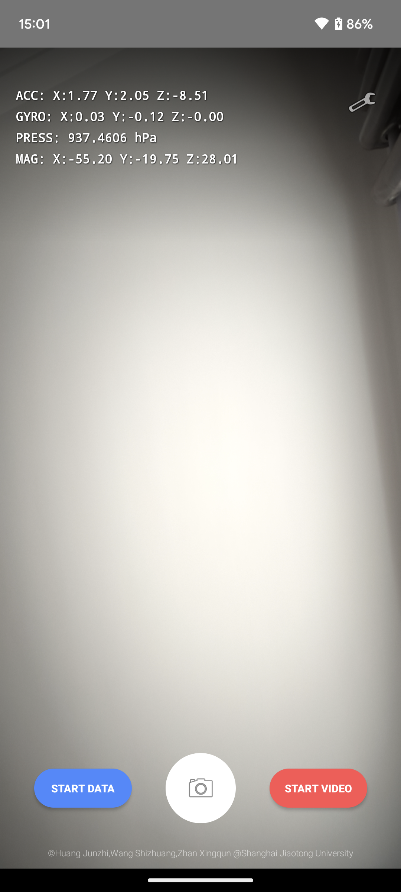
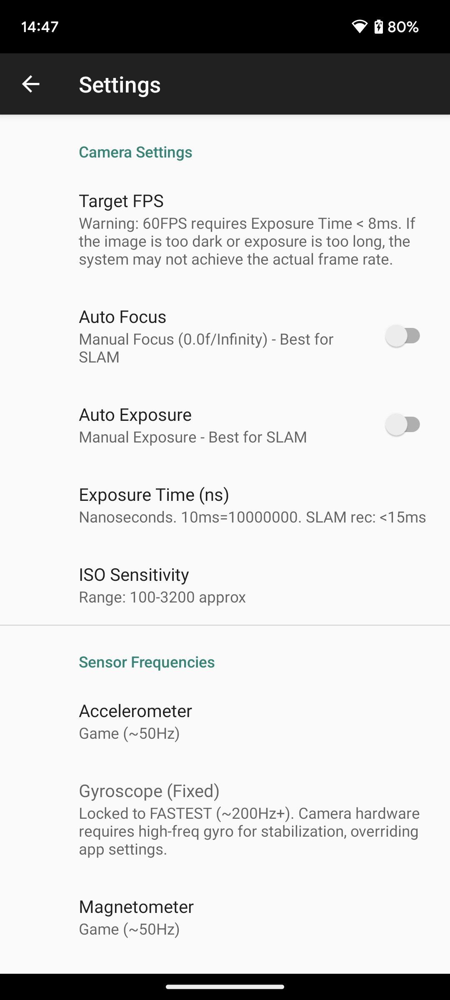

# MobileDataCaptureKit

**MobileDataCaptureKit** is a lightweight, modular Android application designed for researchers to capture **synchronized camera and sensor data** using a smartphone.

This tool integrates the **Android Camera2 API** with multiple onboard IMU sensors to record high-quality video and time-aligned sensor streams. It is optimized for research in **mobile sensing, computer vision (SLAM/VIO), robotics, and dataset collection**.

---

## User Interface



The application interface is designed for simplicity and real-time monitoring:

1.  **Real-Time Sensor Overlay (Top-Left):**
    *   Displays instantaneous readings for **ACC** (Accelerometer), **GYRO** (Gyroscope), **PRESS** (Barometer), and **MAG** (Magnetometer) to ensure sensors are active before recording.
2.  **START DATA (Blue Button):**
    *   Starts logging raw sensor data to a CSV file *without* recording video. Useful for IMU calibration or non-visual data collection.
3.  **Shutter Button (Center Camera Icon):**
    *   Captures a high-resolution still image and saves it to the system Gallery.
4.  **START VIDEO (Red Button):**
    *   Begins video recording. This  triggers the logging of frame-level metadata.
## Settings Interface



### Camera Settings

- **Target FPS:** Select between 15, 30, or 60 FPS.
  - *⚠️ Note on 60 FPS:* To achieve a stable 60 FPS, the **Exposure Time must be set lower than 8ms (< 8,000,000 ns)** in Manual Exposure mode. If the exposure is too long (e.g., default 15ms), hardware readout latency limits the camera's maximum frame rate to below 60 FPS..
- **Focus Mode:** Toggle between **Continuous Auto Focus** and **Manual Focus** (Locked at 0.0f/Infinity). Manual focus is recommended for SLAM to prevent focal length changes.
- **Exposure Mode:** Toggle between **Auto** and **Manual**.
- **Manual Parameters:**
  - **Exposure Time (ns):** Set absolute exposure duration in nanoseconds (e.g., 10000000 for 10ms). Short exposure reduces motion blur.
  - **ISO Sensitivity:** Manually set ISO (e.g., 800) to balance brightness when using short exposure times.

### Sensor Frequencies

- **Adjustable Sensors:** Set sampling rates (Fastest, Game, UI, Normal) for Accelerometer, Magnetometer, and Barometer.
- **Gyroscope (Fixed):** The Gyroscope frequency is **locked to FASTEST (~200Hz+)**.
  - *Reason:* When the Camera is active, the Android hardware abstraction layer (HAL) reserves high-frequency gyro data for OIS/EIS stabilization, overriding application-level frequency requests.

---

## Authors

**黄俊植（Junzhi Huang）** – Shanghai Jiao Tong University — （Email: biscu0@sjtu.edu.cn）

**王士壮（Shizhuang Wang）** – Shanghai Jiao Tong University — （Email: sz.wang@sjtu.edu.cn）

---

## Features

- **Advanced Camera2 API Integration**
    - Records video (H.264/MP4) with configurable parameters.
    - Captures high-resolution still images.
    - **Frame-Level Metadata**: Logs Timestamp, Exposure Time, ISO, and Focal Length for every video frame to a CSV file.

- **Multi-Sensor Data Logging**
    - Synchronously records data from:
        - Accelerometer
        - Gyroscope
        - Magnetometer
        - Pressure Sensor (Barometer)
    - Data is saved in CSV format with high-precision timestamps.

- **Modern Android Storage Support**
    - Fully compatible with **Android 10+ Scoped Storage**.
    
    - Videos and Images are automatically saved to the system **Gallery**.

    - Raw sensor data files are accessible via the app's private external storage 
    
      (`/Android/data/...`).
    
- **Modular Architecture**
    - Refactored codebase separating Camera, Sensor, and File logic for easy extension and maintenance.

---

## Project Structure

```text
/app
├── java/com/example/mobiledatacapturekit
|	├── Appconfig			   # Parameter Settings
│   ├── MainActivity.java      # UI Controller & Permission handling
│   ├── CameraHelper.java      # Camera2 API & MediaRecorder logic
│   ├── SensorHelper.java      # SensorManager & IMU data processing
|	├── SettingsActivity.java  # Read Settings
│   └── FileUtils.java         # File I/O & MediaStore integration
│
├── AndroidManifest.xml        # Permissions & Hardware feature declarations
└── res/layout
    └── activity_camera.xml    # User Interface layout
```

---

## Data Output Format

The application generates the following files during recording:

### 1. Video Metadata (`META_yyyymmdd_HHmmss.csv`)
Logs camera properties for each frame synchronized with the video.
```csv
Frame,Timestamp,Exposure,ISO,FocalLen
0,1769523611631,18613238,711,6.81
1,1769523611702,18613238,711,6.81
2,1769523611740,18613238,711,6.81
3,1769523611772,18427724,711,6.81
4,1769523611801,18233376,711,6.81
5,1769523611835,17897684,711,6.81
...
```

### 2. Sensor Data (`SENS_yyyymmdd_HHmmss.csv`)
Logs high-frequency IMU data.
```csv
Timestamp,SensorType,X,Y,Z,Value
22:20:10.385,GYRO,-0.5715,0.3893,0.1707,
22:20:10.386,ACC,0.4098,9.4433,3.2877,
22:20:10.387,GYRO,-0.5751,0.3746,0.1671,
22:20:10.388,ACC,0.4289,9.4433,3.3308,
22:20:10.389,GYRO,-0.5715,0.3600,0.1622,
22:20:10.390,ACC,0.4289,9.4337,3.3733,
22:20:10.391,MAG,-12.2000,-43.4076,5.4534,
22:20:10.392,GYRO,-0.5678,0.3392,0.1535,
22:20:10.393,ACC,0.4624,9.4289,3.3972,
22:20:10.394,GYRO,-0.5556,0.3244,0.1472,
22:20:10.394,ACC,0.4433,9.3858,3.4588,
22:20:10.396,GYRO,-0.5444,0.3073,0.1374,
22:20:10.401,ACC,0.4624,9.3326,3.5061,
22:20:10.407,PRESS,,,941.8298
...
```
Videos/images are automatically saved to the system gallery, and can also be found at 

(Android/data/com.example.mobiledatacapturekit/files/Videos...).

Original CSV data is securely stored in the app's private directory 

(Android/data/com.example.mobiledatacapturekit/files/SensorData...).

Frame-level data recording: When recording videos, a synchronized Metadata CSV file is automatically generated to record the exact timestamp, exposure time, ISO, and focal length of each frame. It is stored in the app's private directory (Android/data/com.example.mobiledatacapturekit/files/MetaData...).

*Note：You can use **DataSeparation.py** to quickly separate the sensor data into four files: ACC.csv, GYRO.csv, MAG.csv, PRESS.csv. The files are as follows*

ACC.csv

```csv
Timestamp,X,Y,Z
22:20:10.386,0.4098,9.4433,3.2877
22:20:10.388,0.4289,9.4433,3.3308
22:20:10.390,0.4289,9.4337,3.3733
22:20:10.393,0.4624,9.4289,3.3972
22:20:10.394,0.4433,9.3858,3.4588
22:20:10.401,0.4624,9.3326,3.5061
```
GYRO.csv
```csv
Timestamp,X,Y,Z
22:20:10.385,-0.5715,0.3893,0.1707
22:20:10.387,-0.5751,0.3746,0.1671
22:20:10.389,-0.5715,0.3600,0.1622
22:20:10.392,-0.5678,0.3392,0.1535
22:20:10.394,-0.5556,0.3244,0.1472
22:20:10.396,-0.5444,0.3073,0.1374
```
MAG.csv
```csv
Timestamp,X,Y,Z
22:20:10.391,-12.2000,-43.4076,5.4534
22:20:10.416,-13.2980,-43.3100,5.4778
22:20:10.426,-11.1508,-43.9200,7.8934
22:20:10.435,-12.9686,-44.5178,4.2090
22:20:10.441,-14.4936,-43.8590,4.7702
22:20:10.448,-17.7754,-45.6890,1.5372
```
PRESS.csv
```csv
Timestamp,Value
22:20:10.407,941.8298
22:20:10.429,941.7969
22:20:10.447,941.8349
22:20:10.458,941.8148
22:20:10.482,941.7961
22:20:10.496,941.8292
```


## Requirements

- **Android Studio** (Flamingo or later recommended)
- **Android SDK Platform 33** (Compile SDK)
- **Minimum Android Version:** Android 10 (API Level 29)
- **Device:** Smartphone with Camera2 API support and relevant sensors.

---

## Getting Started

### 1. Clone the repository
```bash
git clone https://github.com/HuangJZh/MobileDataCaptureKit.git
```

### 2. Open in Android Studio
* Select **File > Open** and choose the `MobileDataCaptureKit` directory.
* Allow Gradle to sync and download dependencies.

### 3. Build & Run
1. Connect an Android device via USB.
2. Ensure "Developer Options" and "USB Debugging" are enabled on the phone.
3. Click **Run * in Android Studio.

### 4. Permissions
Upon the first launch, grant the following permissions:
* **Camera** (for video/photo)
* **Microphone** (for audio recording)
* *Note: Storage permission is not required for Android 10+ due to Scoped Storage implementation.*

---

## License

This project is open-source and available for research and educational purposes.
